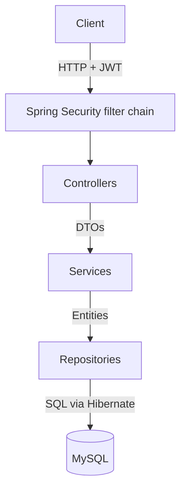
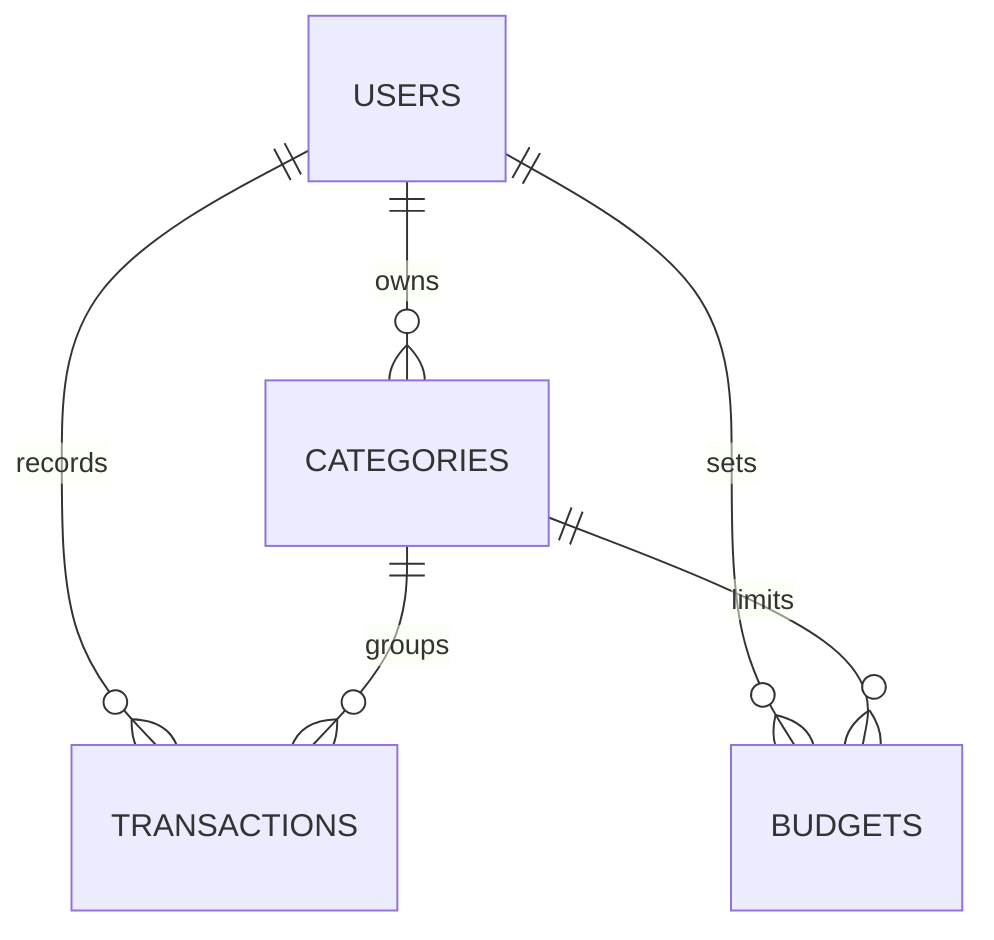

# Budget Tracker API

A REST API for personal budgeting, built with Java and Spring Boot. Users record income and expenses by category, set monthly budgets, and get a monthly summary showing spending against budget, with over-budget categories flagged.

Each user has their own account, authenticated with JWTs, and can only ever access their own data.

## Features

- **Web interface**: a simple single-page frontend (HTML and JavaScript) served by Spring Boot, for managing categories, transactions and budgets visually
- **Accounts and authentication**: registration, login and stateless JWT authentication with Spring Security; passwords hashed with BCrypt
- **Categories**: create, rename and delete spending and income categories
- **Transactions**: record income and expenses, with filtering by date range and category
- **Monthly budgets**: set a spending limit per category per month
- **Monthly summary**: total income, expenses and net amount, with a per-category breakdown of budget, spending, remaining amount and percentage used
- **Data isolation**: every query is scoped to the logged-in user
- **Validation and consistent errors**: invalid input is rejected with clear, field-level messages in a consistent JSON format
- **Automated tests**: unit tests with Mockito and integration tests running the full application against an in-memory database

## Tech stack

Java 21 · Spring Boot · Spring Web · Spring Data JPA (Hibernate) · Spring Security (OAuth2 Resource Server, JWT) · Bean Validation · MySQL · Maven · JUnit 5 · Mockito · AssertJ · H2 (tests) · HTML · JavaScript 

## Architecture

The app follows the layered controller-service-repository pattern common in enterprise Java applications:



- **Security filter chain** verifies the JWT on every request before it reaches a controller
- **Controllers** handle HTTP concerns only: routes, request bodies, status codes
- **Services** hold the business rules, such as ownership checks, duplicate prevention and the summary calculations
- **Repositories** handle data access, using Spring Data JPA's derived queries and JPQL
- **DTOs** define exactly what enters and leaves the API, keeping internal fields such as password hashes out of responses

## Data model



Unique constraints enforce the key rules at the database level: one account per email, no duplicate category names per user, and one budget per category per month.

## Project structure

```
src/main/java/com/raynald/budget_tracker/
├── controller/    # REST endpoints
├── service/       # business logic, including the current-user lookup
├── repository/    # Spring Data JPA repositories and query projections
├── entity/        # JPA entities: User, Category, Transaction, Budget
├── dto/           # request and response records
├── security/      # Spring Security and JWT configuration
├── exception/     # custom exceptions and the global error handler
└── src/main/resources/static/index.html   # web frontend
src/test/java/...  # unit and integration tests
docs/requirements.md
```

## Getting started

### Prerequisites

- Java 21
- MySQL 8 or later

### 1. Create the database

```sql
CREATE DATABASE budget_tracker;
CREATE USER 'budget_app'@'localhost' IDENTIFIED BY 'your-password';
GRANT ALL PRIVILEGES ON budget_tracker.* TO 'budget_app'@'localhost';
FLUSH PRIVILEGES;
```

### 2. Set environment variables

Secrets are read from environment variables and never stored in the code:

```bash
export DB_PASSWORD='your-password'
export JWT_SECRET="$(openssl rand -base64 48)"   # must be at least 32 characters
```

### 3. Run

```bash
git clone https://github.com/RaynaldCloud/budget-tracker.git
cd budget-tracker
./mvnw spring-boot:run
```

Open http://localhost:8080 to use the web interface. The API itself is available under `/api`, and the tables are created automatically on first run.

## Using the API

All endpoints except register and login require a token in the `Authorization` header.

```bash
# Register
curl -X POST localhost:8080/api/auth/register -H "Content-Type: application/json" \
  -d '{"email":"alice@example.com","password":"password123","name":"Alice"}'

# Log in and receive a token
curl -X POST localhost:8080/api/auth/login -H "Content-Type: application/json" \
  -d '{"email":"alice@example.com","password":"password123"}'

# Use the token on other requests
curl localhost:8080/api/summary -H "Authorization: Bearer <token>"
```

### Endpoints

| Method | Endpoint | Description |
| --- | --- | --- |
| POST | `/api/auth/register` | Create an account |
| POST | `/api/auth/login` | Log in and receive a JWT |
| GET | `/api/auth/me` | Current user's details |
| GET | `/api/categories` | List categories |
| POST | `/api/categories` | Create a category |
| PUT | `/api/categories/{id}` | Rename a category |
| DELETE | `/api/categories/{id}` | Delete a category (blocked if it has transactions or budgets) |
| GET | `/api/transactions` | List transactions. Optional filters: `from`, `to` (YYYY-MM-DD), `categoryId` |
| GET | `/api/transactions/{id}` | Get one transaction |
| POST | `/api/transactions` | Record a transaction |
| PUT | `/api/transactions/{id}` | Update a transaction |
| DELETE | `/api/transactions/{id}` | Delete a transaction |
| GET | `/api/budgets` | List a month's budgets. Optional: `year`, `month` |
| PUT | `/api/budgets` | Create or update a category's budget for a month |
| DELETE | `/api/budgets/{id}` | Delete a budget |
| GET | `/api/summary` | Monthly summary. Optional: `year`, `month` (defaults to the current month) |

### Example: monthly summary

`GET /api/summary?year=2026&month=9`

```json
{
  "year": 2026,
  "month": 9,
  "totalIncome": 1500.00,
  "totalExpense": 33.70,
  "net": 1466.30,
  "overBudgetCount": 1,
  "categories": [
    {
      "categoryId": 1,
      "categoryName": "Food",
      "budget": 20.00,
      "spent": 33.70,
      "remaining": -13.70,
      "percentUsed": 169,
      "overBudget": true
    }
  ]
}
```

### Error format

Every error uses the same JSON structure. Validation errors also list each invalid field:

```json
{
  "timestamp": "2026-09-24T11:27:39Z",
  "status": 400,
  "error": "Bad Request",
  "message": "Validation failed",
  "path": "/api/transactions",
  "fieldErrors": {
    "amount": "Amount must be greater than zero"
  }
}
```

Status codes: `400` invalid input, `401` missing or invalid token, `404` not found (including other users' data), `405` unsupported method, `409` conflict with existing data.

## Running tests

```bash
./mvnw test
```

Tests use an in-memory H2 database, so they don't need MySQL or any environment variables.

- **Unit tests** (Mockito) cover the monthly summary calculations and month validation in isolation
- **Integration tests** (MockMvc) run the full application, including the security filter chain, and cover authentication, validation errors, data isolation between users, and the end-to-end summary flow

## Design decisions

- **Stateless JWT authentication** using Spring Security's OAuth2 Resource Server support rather than custom token code. Tokens are signed with HS256 and expire after one hour.
- **Password security**: BCrypt hashing, a 72-character maximum to match BCrypt's input limit, and identical error messages for unknown emails and wrong passwords to prevent user enumeration.
- **Single source of the current user**: every service gets the logged-in user from `CurrentUserService`, so authentication logic lives in one place. Swapping a placeholder user for real JWT authentication changed only that class.
- **Ownership checks on every lookup**: records are fetched by ID *and* owner. Another user's data returns 404 rather than 403, so the API doesn't reveal that it exists.
- **`BigDecimal` for money**, avoiding floating-point rounding errors, with amounts compared using `compareTo`.
- **Aggregation in the database**: the monthly summary uses `SUM` with `GROUP BY` rather than loading every transaction into memory.
- **`JOIN FETCH`** when listing transactions and budgets, avoiding the N+1 query problem.
- **DTOs separate from entities**, so the API's contract is explicit and internal fields never leak.
- **Idempotent budget updates**: `PUT /api/budgets` creates or updates, so repeating a request never creates duplicates.
- **Secrets in environment variables**, never in source code or version control.

## Limitations and future improvements

- Rebuild the frontend in React with TypeScript
- Use Testcontainers to run integration tests against real MySQL instead of H2
- Manage schema changes with Flyway migrations instead of Hibernate's automatic updates
- Add pagination to the transactions list
- Add refresh tokens, so users stay logged in without long-lived access tokens
- Add continuous integration with GitHub Actions to run the tests on every push

## Author

**Raynald Lim** · [LinkedIn](https://www.linkedin.com/in/raynald-lim/) · [GitHub](https://github.com/RaynaldCloud)